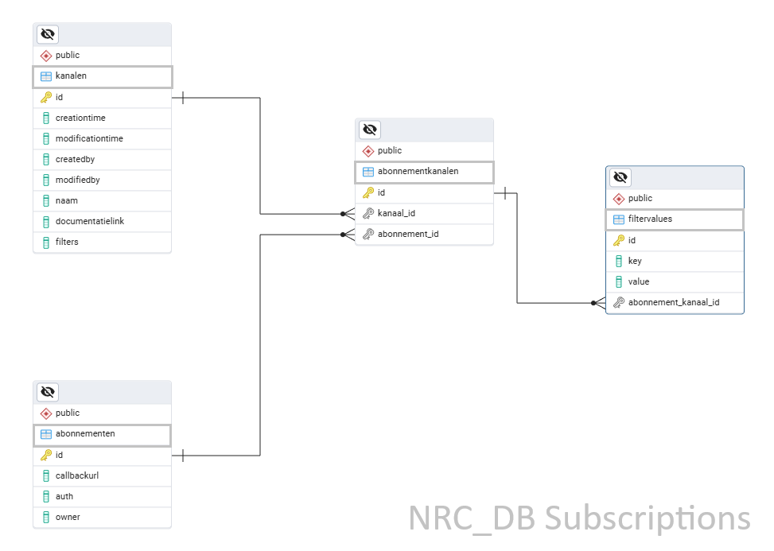

# Notification Database: Subscription Data Model

This document outlines the subscription data model within the NRC database.

**Goal:** To clarify the relationship between tables, specifically focusing on the `abonnementkanalen` table. While this table may appear to contain duplicate records, this design is intentional and necessary for the flexible functioning of notification filters.

---

## 1. Kanalen

**OAS Resource:** [`kanaal`](https://vng-realisatie.github.io/gemma-zaken/standaard/notificaties/redoc-1.0.0#tag/kanaal/operation/kanaal_create)

The `kanalen` table represents the source of notifications (e.g., 'zaken' or 'besluiten' in the ZRC).

| Column                 | Description                                                                               |
| :--------------------- | :---------------------------------------------------------------------------------------- |
| **`id`**               | **Primary Key.** Unique identifier for the kanaal.                                        |
| **`naam`**             | The name of the channel (e.g., `zaken`, `besluiten`).                                     |
| **`documentatielink`** | URL pointing to the documentation for this specific channel.                              |
| **`filters`**          | A list of available attributes that can be used to filter subscriptions for this channel. |

---

## 2. Abonnementen

**OAS Resource:** [`abonnement`](https://vng-realisatie.github.io/gemma-zaken/standaard/notificaties/redoc-1.0.0#tag/abonnement/operation/abonnement_create)

The `abonnementen` table stores the actual subscriptions for ZGW notifications received via POST requests.

| Column            | Description                                                                  |
| :---------------- | :--------------------------------------------------------------------------- |
| **`id`**          | **Primary Key.** Unique identifier for the subscription.                     |
| **`callbackurl`** | The full webhook URL of the application where the notification must be sent. |
| **`auth`**        | The bearer token required by the webhook receiver for authorization.         |
| **`owner`**       | The RSIN of the organization granting access to the application.             |

---

## 3. Abonnementkanalen

**OAS Element:** `kanalen` array within `abonnement`.

This table establishes an **N:M (Many-to-Many)** relationship between `abonnementen` and `kanalen`.

> **Key Concept:** The Primary Key (`id`) of this table is referenced by the `filtervalues` table. This architecture allows a single subscription to link to the _same_ `kanaal` multiple times. While this looks like duplicate data, it allows different sets of `filtervalues` to be applied to the same channel within one subscription.

| Column              | Description                                                           |
| :------------------ | :-------------------------------------------------------------------- |
| **`id`**            | **Primary Key.** Referenced by `filtervalues`.                        |
| **`abonnement_id`** | **Foreign Key.** Points to the parent subscription in `abonnementen`. |
| **`kanaal_id`**     | **Foreign Key.** Points to the source channel in `kanalen`.           |

---

## 4. Filtervalues

**OAS Element:** `filters` element within `abonnement`.

To prevent message flooding, subscriptions often restrict which notifications they receive. The `filtervalues` table stores these restrictions.

| Column                     | Description                                                                                                                                                                                                   |
| :------------------------- | :------------------------------------------------------------------------------------------------------------------------------------------------------------------------------------------------------------ |
| **`id`**                   | **Primary Key.**                                                                                                                                                                                              |
| **`abonnement_kanaal_id`** | **Foreign Key.** Links to the `abonnementkanalen` table.                                                                                                                                                      |
| **`key`**                  | The filter name. Valid values are listed in `kanalen.filters`.   Special values include: • `#resource`: The resource triggering the event. • `#actie`: The event type (e.g., create, destroy). |
| **`value`**                | The specific value to match against.                                                                                                                                                                          |

### Example Usage

If you want to filter for a specific domain, the definition for the **zaken** channel might look like this:

- **Key:** `domein`
- **Value:** `VTH`

_Result: The notification is delivered only if the 'zaak' belongs to a 'zaaktype' within the 'VTH' domain._

---

## Logic: Combining Filters

The data model supports complex filtering logic by combining multiple `filtervalues` and multiple `abonnementkanalen`.

### The Logic Rule

> 1. **Inside** a single `abonnementkanaal`: Filters are combined with **AND**.
> 2. **Between** different `abonnementkanalen` (for the same subscription): Logic is combined with **OR**.

### Scenario: "Create OR Delete"

A client application wants to receive notifications from the `zaken` channel _only_ when a `zaakinformatieobject` is **created** OR **deleted**.

**Abonnementkanalen ID: 1** (The "Create" Condition)

- Filter A: `key='#resource'`, `value='zaakinformatieobject'`
- Filter B: `key='#actie'`, `value='create'`
- _Logic: Resource is object **AND** action is create._

**Abonnementkanalen ID: 2** (The "Delete" Condition)

- Filter A: `key='#resource'`, `value='zaakinformatieobject'`
- Filter B: `key='#actie'`, `value='destroy'`
- _Logic: Resource is object **AND** action is destroy._

**Final Result:**
If (Object created) **OR** (Object destroyed) then **Send Notification**.
